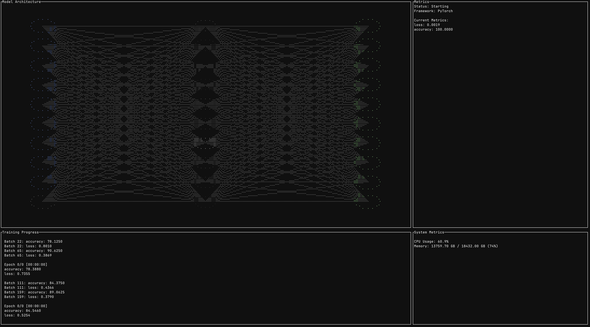

# Aliyah

---

Work in progress 

Being able to see to see my model train and interact with it in the terminal is important to me 

Wrapper libary in `/python`


Keyboard Controls

q/ESC : Quit

p/SPACE: Pause/Resume training

s     : Stop training

e     : Toggle error log

↑/↓   : Scroll error log | Scroll training log 

c     : Clear error log

h     : Show this help

tab/n : Show node information 

click : Switch training and node panel

o     : Output panel 

---

#### Pre-Alpha Release 

```bash 
git clone https://github.com/lovechants/Aliyah.git 
cargo build
pip install -e . 
cargo run -- <script.py>
```
data folder is for example scripts only

---



---

## Current TODO 

- [x] Fix mouse input cature bug when you exit (if clicked)
- [ ] Fix help render bug 
- [ ] Make plotting more robust
- [ ] Make visualization better for networks 
- [ ] Make classic machine learning visualizations (not just networks)
- [ ] Update examples (Make more robust examples with the new features and remove the original test examples)
- [ ] Test custom metrics (if its properly working now)
- [ ] Make framework hooks for visualizations 
    - [x] PyTorch 
    - [ ] JAX 
    - [ ] Keras
    - [ ] TF 
    - [ ] TinyGrad
    - [ ] SciKit Learn 
    - [ ] Custom 
    - [ ] Default 
- [ ] User Config 
- [ ] Publish Packages for pip, uv, and cargo 

---

Roadmap to 1.0 alpha 

## 1. Core Infrastructure
- [x] Install and set up ZMQ dependencies (Rust and Python)
- [x] Create ZMQ context and socket management
- [x] Implement basic message patterns
  - [x] Command channel (REQ-REP)
  - [x] Metrics channel (PUB-SUB)
  - [x] Control flow channel

## 2. Python Monitor Library
- [x] Update monitor class for ZMQ
  - [x] Command handling
  - [x] Metric sending
  - [x] Control flow checks
- [ ] Context manager implementation
- [x] Error handling and recovery
- [x] Basic metric formatting
- [x] Safe cleanup on exit

## 3. Rust UI Updates
- [x] ZMQ socket integration
- [x] Command sending system
- [x] Metric receiving and parsing
- [x] Update existing UI components for new data flow
- [x] Error handling and connection management

## 4. Core Features for 0.1a
- [x] Training control (pause/resume/stop)
- [x] Basic metric display
  - [x] Loss
  - [x] Accuracy
  - [x] Epoch progress
- [x] Simple network visualization
- [x] Resource monitoring
  - [ ] Basic GPU stats
    - [ ] Test Metal 
    - [ ] Test NVIDIA 
    - [ ] Test AMD 
  - [x] Memory usage
  - [x] CPU usage

## 5. Testing and Validation
- [x] Basic integration tests
- [ ] Cross-platform testing
- [x] Error recovery testing
- [x] Example scripts

## 6. Documentation
- [x] Usage guide
- [ ] Example implementations
- [x] Installation instructions
- [x] Clean up codebase (again)

## Future Features (Post 1.0a)
- User configuration 
- Layer-specific visualization
- Advanced GPU monitoring
- Custom metric tracking
- Interactive parameter adjustment
- Extended framework support
- Advanced network visualization
- Custom algorithm support
